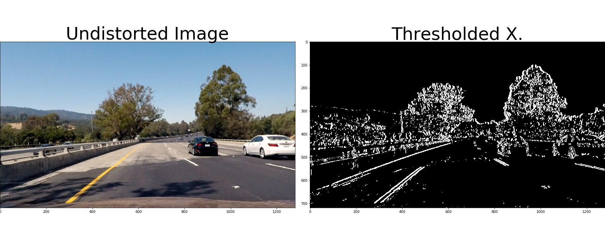
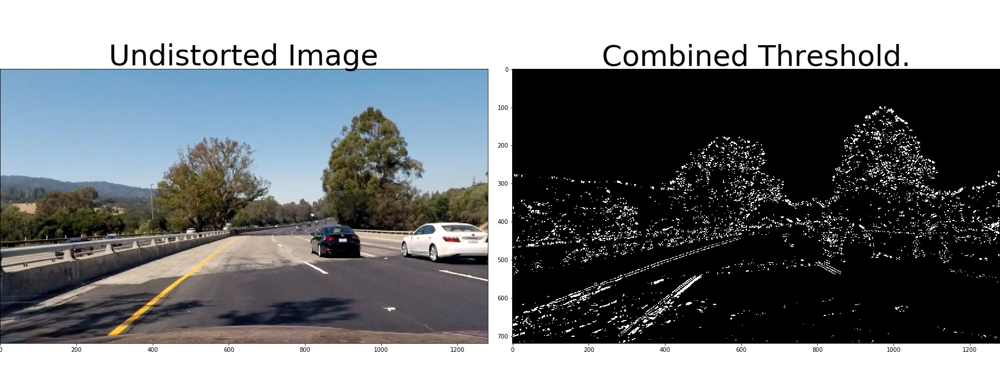
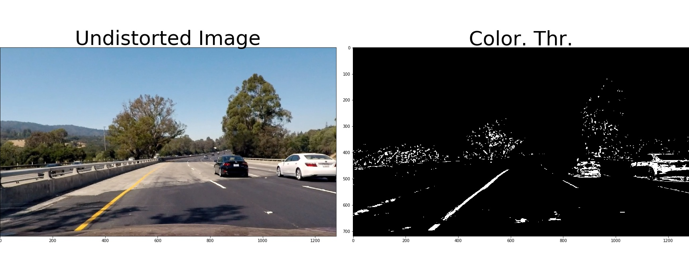
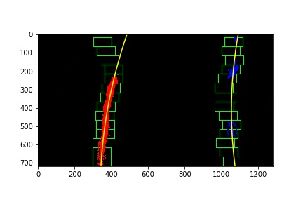
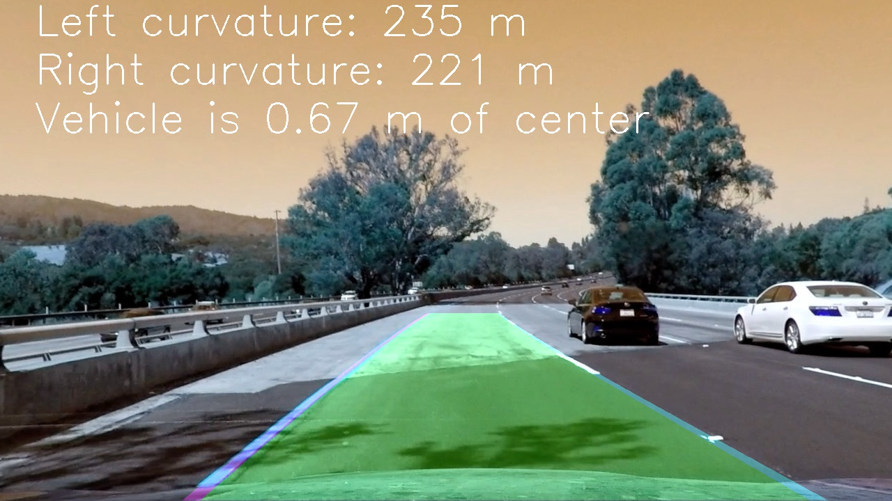

# Advanced Lane Finding Project
This is the second Project of the Self Driving Car Engineer NanoDegree by Udacity. In this project the objective is to write a pipeline to identify lane lines in a video from a front-facing camera on a car. The designed pipeline is written in python and use numpy and OpenCV.

The camera calibration images, test road images, and video used to test the pipeline were provided for Udacity. Also, some functions provided in the nanodegree course were used. In this project the following assumptions are made:
- The camera is always in the same relative position to the vehicle.
- There is not a high traffic of vehicles in the vicinity of the vehicle that we are controlling.

The general steps of this project are the following:
Compute the camera calibration matrix and distortion coefficients given a set of chessboard images. 
- Apply a distortion correction to raw images. 
- Use color transforms, gradients, etc., to create a thresholded binary image. 
- Apply a perspective transform to rectify binary image ("birds-eye view"). 
- Detect lane pixels and fit to find the lane boundary. 
- Determine the curvature of the lane and vehicle position with respect to center. 
- Warp the detected lane boundaries back onto the original image. 
- Output visual display of the lane boundaries and numerical estimation of lane curvature and vehicle position. 

[//]: # (Image References)

Next, I will describe in a general way each of the previous steps. The designed pipeline and the tests performed on it can be found on the Jupyter notebook [My_P2](https://github.com/JKWalleiee/CarND-Advanced-Lane-Lines/My_P2.ipynb). From now on, whenever the notebook is referenced, the following notation will be use: in [No].

The central functions used throughout the pipeline can be found in the second cell of the notebook code. Also, a group of visualization fuses that were used in the tests is in the third code cell.

## Camera Calibration
The code of this stage is found in the central functions (camera_matrix and distortion_correction in [2]), and the test section is in the cells [5] and [6]. In this stage, the function cv2.findChessboardCorners of OpenCV is used to calculate the edges of the calibration images and save those corners in an array, imgpoints. The object points are stored in a second array called objpoints. The imgpoints and objpoints are used to compute the camera calibration and distortion coefficients using the cv2.calibrateCamera function. After this, cv2.undistort function is used to correct the distortion of the test images. An example of the result of this stage can be seen below:

 

## Pipeline (single images)
The code used to implement these functionality could be found in the central functions (in [7] to [18]). This pipeline is divided into 6 sub-stages.

### Undistort the images
In this stage, the input image is undistorted using the camera calibration and distortion coefficients calculated in the calibration step.

  

### Gaussian smoothing
The code of this stage could be found in the central functions( gaussian_blur in [2] ), and the test section is in [7]. The goal in this stage is to decrease the noise in the image, inherent to the camera. In this step a small kernel size was used, because in the tests carried out it was observed that a large kernel erased important information from the lines in some frames of the test video.

 

### Thresholded binary image
In this stage 4 types of thresholds were used: 3 gradients thresholds and one color threshold.

The gradient thresholds were: A sobel X gradient, and Magnitude gradient threshold and a Gradient direction threshold. These 3 thresholds receive as input the output of the Gaussian filter. The sobel X gradient (abs_sobel_thresh in [2]) was selected because the lane lines are mainly described with the gradient changes in the X direction. moreover, the magnitude (mag_thresh in [2]) and direction gradient (dir_threshold in [2]) were selected with the objective of extracting the gradient changes in the image where the gradient change has a magnitude that exceeded a defined threshold and has a direction similar to the direction expected for the lane lines.
Next, each of these 3 separate thresholds and their combinations are shown.

 
 
 
 

For the color gradient, an HSL transformation of the undistorted input image was used, and its S channel was extracted, because this channel varies less in the presence of lighting changes in the environment. This channel was used together with a defined threshold to extract the white and yellow lines (hls_select in [2]).

 
 

The S channel color threshold usually has problems to detect some white lines, in comparison to the yellow lines, due to this, this threshold was combined with the previous combined gradient threshold. For the tests of this stage (in [8] - [13]) the following results were obtained:

 
 

### Perspective transformation
The perspective transformation code could be found in [2] (bird_eye_transform), and the test code is in [14]. In this stage the first step is to calculate four points in the undistorted input image (source image) and configure a set of destination points for the transformation. This points were selected by trial and error, with the aim of having the parallel lane lines in the final image.

| Source        | Destination   | 
|:-------------:|:-------------:| 
| 120, 720      | 220, 720        | 
| 570, 450      | 220, 0      |
| 710, 450     | 1060, 0      |
| 1160, 720      | 1060, 720        |

Using cv2.getPerspectiveTransform (get_perspective_matrix in [2]), a direct and inverse transformation matrix were calculated. The result of the transformation (warp_image in [2]) on a test image is the following:

 
 

### Calculating polynomials
The lane line polynomial detection could be found in find_polynomial and find_lane_pixels in [2]. In this stage, the input image is divided in half (one section for each line), and the algorithm calculates the histogram on the X axis. For each division of the image, the peak of the histogram is calculated. From this central point, the function calculates the convolution between the points in the image and a sliding window, whose width depends on the parameters configured for the algorithm (width of the window and search margin). For each convolutional window the number of points found (points with value "1") is calculated, and compared with a minimum number of points desired, if this condition is satisfied, the points found are stored in a vector (for each lane line) . At the end, all the valid points found are used to calculate a polynomial through the method np.polyfit. It should be stressed that the algorithm designed use the points and not the centroids of the windows for the calculation of the polynomial, in other words, it is not important that all the sliding windows have valid points. The result of the above can be seen below:

 

Another function, search_around_poly in [2], performs basically the same task, but this function not calculate the polynomial from scratch, instead, use a previous polynomial (from a previous vdeo frame) and only searching for lane pixels within a certain range of that polynomial.

 

### Radius of curvature and position of the vehicle with respect to the center
The radius of curvature is based upon this [website](https://www.intmath.com/applications-differentiation/8-radius-curvature.php) and calculated in calc_curv_rad_and_center_dist, in [2]. The ecuation used for the calculation of the radius is:

curve_radius = ((1 + (2*poly[0]*y_eval*ym_per_pix + poly[1])**2)**1.5) / np.absolute(2*poly[0])

Where poly is the lane line polynomial (left or right), ym_per_pix is the relation between the distance in pixels and the distance in the real world, and  y_eval is the position of interest (the bottom of the image), where it is desired to calculate the radius.

on the other hand, the position of the vehicle with respect to the center of the lane is calculated with the following ecuation:

lane_center_position = (right_fit_x + left_fit_x) /2
center_dist = (car_pos - lane_center_position) * xm_per_pix

Where right_fit_x and left_fit_x are the right and left polynomials respectively, car_pos is the car position in pixels (it is assumed as the center of the image), and xm_per_pix is another relation between the distance in pixels and the distance in the real world, from the expected lane lines width.

### Final Output Image
In draw_lane and put_info (in [2]) could be found the functions for the calculation and display of the lane lines on the original undistorted image. In this stage, a polygon is calculated based on the left and right polynomials, and this polygon is warped back to the original image, using the inverse transformation of the perspective transformation stage.

 

## Pipeline (video)
For the video pipeline test, the class LaneExtractor In [19] was used, which can be used for both, individual images and video frames. In this class, if the input is a video frame, some verifications are carried out (sanity check). If the curvature of the calculated line is between 0.1 and 10000, and the distance between the car and the center of the lane lines does not change more than 0.5 m between the current and previous frame, the lane line is considered valid. Otherwise, the lane line calculated in the previous frame is maintained, and the polynomial of the lane lines is recalculated.

The result of this pipeline can be found in [Output video](https://github.com/JKWalleiee/CarND-Advanced-Lane-Lines/test_videos_output/project_video.mp4)
